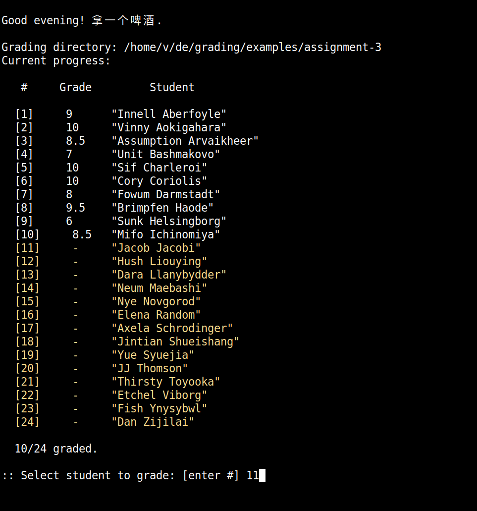

A terminal grading workflow for NYU Classes. I made this to help speed up grading long-form assignments (e.g. reports, essays, etc), and especially to avoid having to deal with the convoluted export format used by Classes.  

<figure>

</figure>

<br>

## Usage

```
Usage: grade <dir> <option>

options:
	-c|--configure		set up directory
	-g|--grade		grading comments selector
	-v|--view		student submissions selector
	-s|--save		save progress
	-p|--pdf		convert markdown comments to pdf
	-t|--stats		show statistics
	-u|--upload		create upload directory
```

- Download the assignment zip file from NYU Classes. Make sure to tick the boxes for "Student submission attachments", "Feedback attachments", and "grades.csv file". 
- Unzip the directory, move to the desired location, etc. 
- Now "configure" the grading directory by running `grade <dir> -c`. This will create a comments.txt file in each student directory, and it will also add a progress.csv file to the directory to log current grading progress and prevent accidental overwrites. 
- Open the student selector by running `grade <dir> -g`. This will print a list of students, based on the list in the grades.csv file, highlighting in yellow the students who haven't been graded yet. 
- Enter the number of the student you want to grade. This will open their comments.txt file (in Vim). 
- In a separate window open the student's submission attachment(s). Running `grade <dir> -v` will do this automatically. It will open pdf files with zathura and docx files with libre. 
- Once finished grading a particular assignment, close the comments.txt file. All the comments.txt files will be parsed, and the comments will be saved to a comments buffer (commentsbuffer.txt) for easy access when grading other assignments. The grades will also be parsed and saved in the grades file (they'll be saved to the file grades-tmp.csv, in order to keep a copy of the original grades file format). 
- When you've finished all grading, run `grade <dir> -u` to create a separate "upload" directory. This will contain only the necessary files for uploading back to NYU Classes. 
