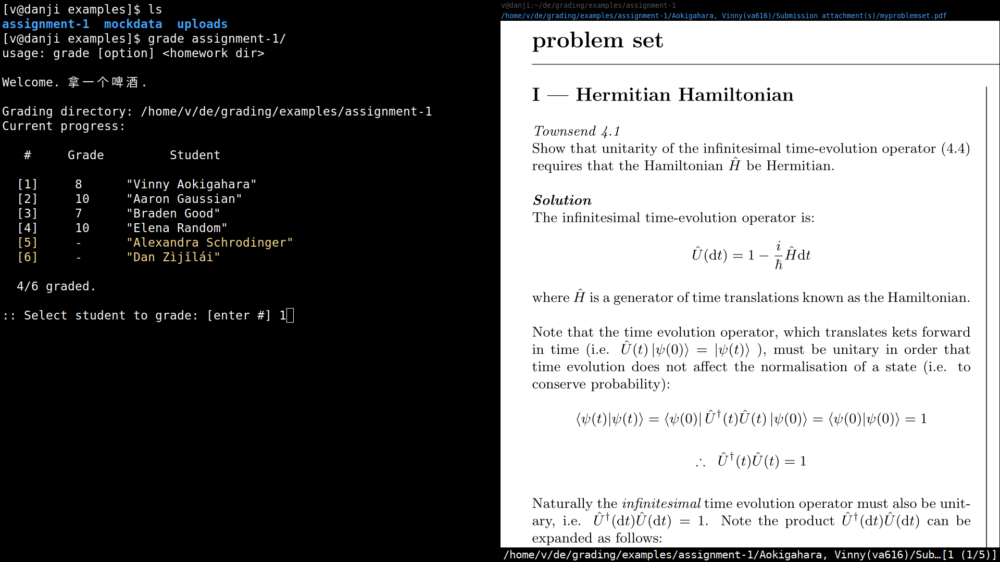

# grading

A (slightly absurd) terminal grading workflow for NYU Classes. I made this to help speed up grading long-form assignments (e.g. lab reports, project essays, etc). It's mostly written in C and Bash, and works (well?) on Linux with the i3 window manager.  



```
./init to add scripts to $PATH. 

Usage: grade [options] <dir>

options:
	-i		initialize (make comments.txt file for each student) 
	-g		parse comments for each student and save grades
	-p		made pdfs (convert markdown files to pdf)
	-u		create upload directory (required format for uploading)	
```
