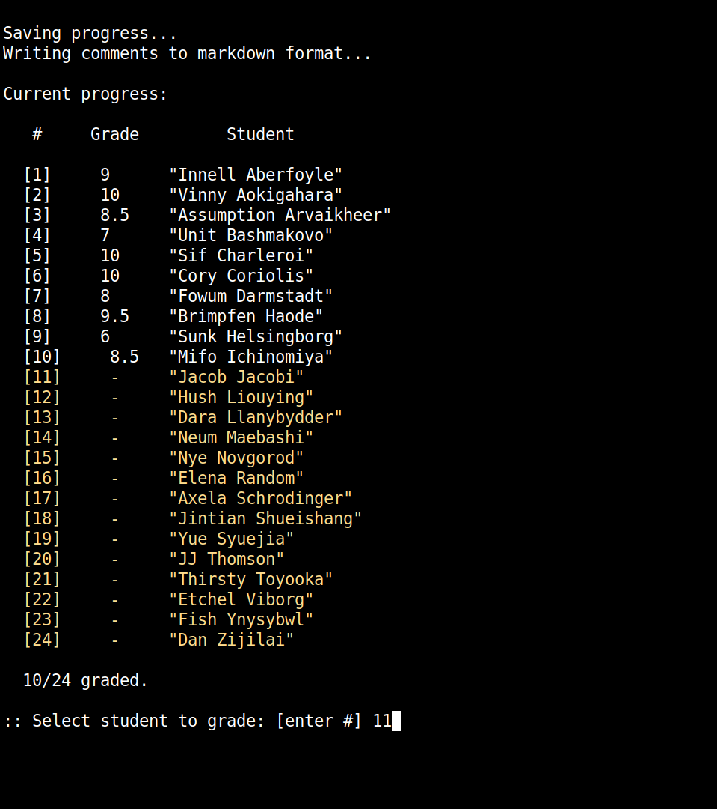

# grading

A terminal grading workflow for NYU Classes. I made this to help speed up grading long-form assignments (e.g. lab reports, project essays, etc). 

<p float="center">
<br>
	
	
<br>
</p>


`./init` to add scripts to `$PATH`. 

```
Usage: grade <dir> <option>

options:
	-c|--configure		set up directory
	-g|--grade		grading comments selector
	-v|--view		student submissions selector
	-s|--save		save progress
	-p|--pdf		convert markdown comments to pdf
	-t|--stats		show statistics
	-u|--upload		create upload directory
```
