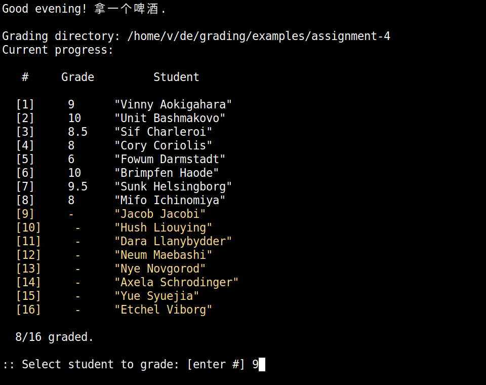
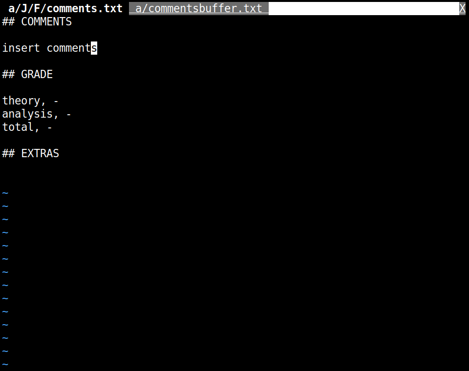
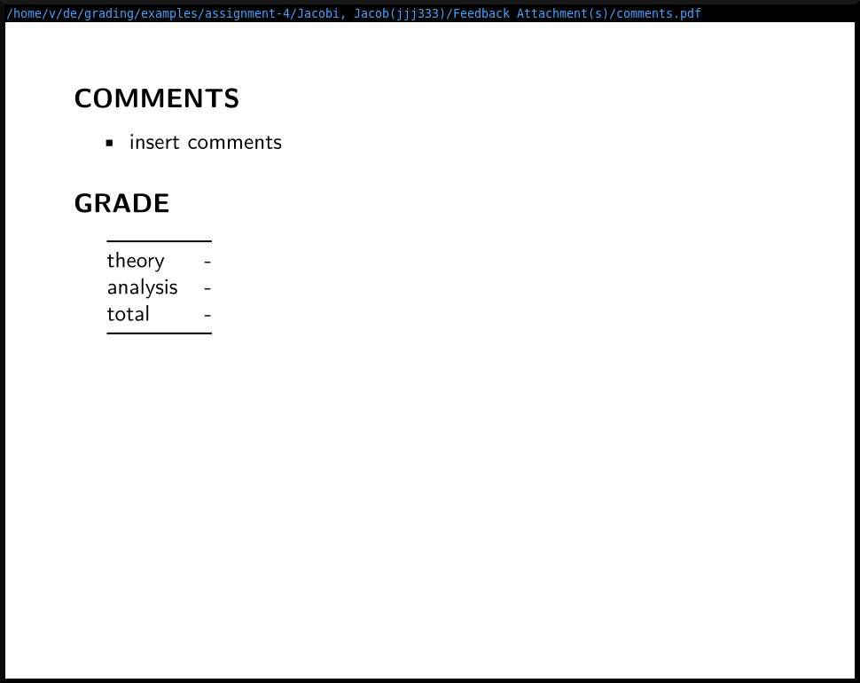

A terminal grading workflow for NYU Classes. I made this to help speed up grading long-form assignments (e.g. reports, essays, etc), and to avoid having to deal with the (convoluted) export format used by Classes.  

<p float="left">
<br>
&nbsp;&nbsp; 

</p>

<p float="left">
&nbsp;&nbsp;  

<br>
</p>

<br>

# CLI flags

```
Usage: grade <dir> <option>

options:
	-c|--configure		configure directory for grading
	-g|--grade		grading comments selector
	-v|--view		student submissions selector
	-s|--save		save progress
	-p|--pdf		generate pdf comments files for each student
	-t|--stats		show summary statistics
	-u|--upload		create upload directory
```

- `-c` to configure/initialize the directory for grading. 
	+ creates a `comments.txt` file in each student directory.
	+ creates a `progress.csv` file in the main directory, to log current grading progress and prevent accidental overwrites. 
	+ creates a `commentsbuffer.txt` file in the main directory, which logs all comments (for all students graded so far), for easy access when grading other assignments. 
- `-g` to enter the grading comments selector. A list of students will be printed, with ungraded ones highlighted in yellow ([fig 1](https://github.com/vaabe/grading/blob/main/media/student-selector.png)).  

# How to use

- Download the assignment zip file from NYU Classes. Tick the boxes for "Student submission attachments", "Feedback attachments", and "grades.csv file". 
- Unzip the directory, move to the desired location, etc. 
- Configure the grading directory by running `grade <dir> -c`. This will create a comments.txt file in each student directory, and it will also add a progress.csv file to the directory. The progress file will log current grading progress and prevent accidental overwrites. 
- Open the student selector by running `grade <dir> -g`. This will print a list of students, based on the list in the grades.csv file. The students who haven't been graded yet are highlighted in yellow.  
- Enter the "number" of the student you want to grade. This will open that student's comments.txt file (in Vim). 
- In a separate window open the student's submission attachment(s). Running `grade <dir> -v` will do this automatically. Pdf files are opened with zathura and docx files with libre. 
- Once finished grading a particular assignment, close the comments.txt file. All the comments.txt files will be parsed, and the comments will be saved to a comments buffer (commentsbuffer.txt) for easy access when grading other assignments. The grades will also be parsed and saved in the grades file (they'll be saved to the file grades-tmp.csv, in order to keep a copy of the original grades file format). 
- When you've finished all grading, run `grade <dir> -u` to create a separate "upload" directory. This will contain only the necessary files for uploading back to NYU Classes. 
