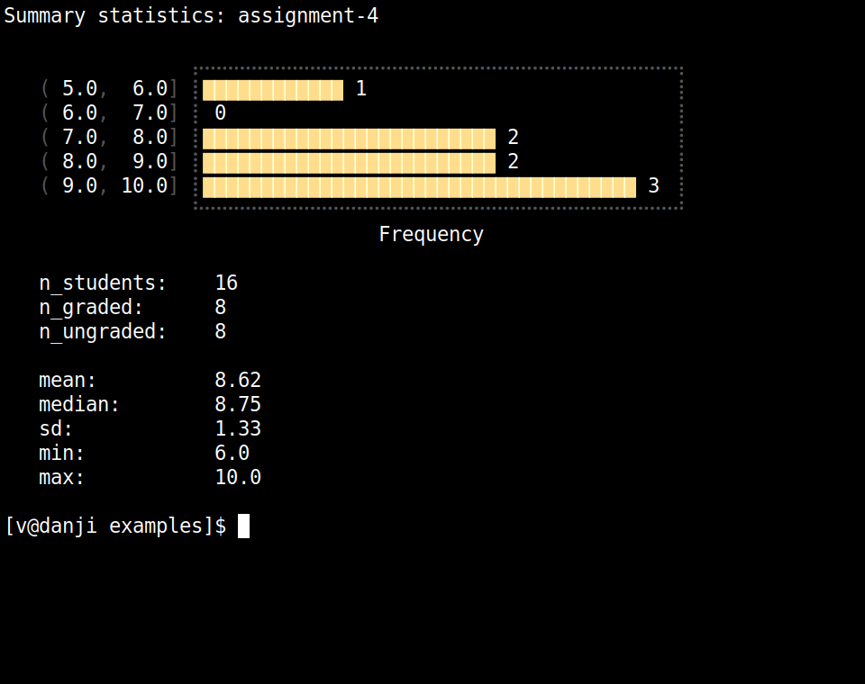

A "terminal" grading workflow for NYU Classes. I made this to help speed up grading long-form assignments (e.g. reports, essays, etc), and to avoid having to deal with the (convoluted) export format used by Classes.  

<p float="left">
<br>
&nbsp;&nbsp; 

</p>

<p float="left">
&nbsp;&nbsp;  

<br>
</p>

<br>

# CLI flags

```
Usage: grade <dir> <option>

options:
	-c|--configure		configure directory for grading
	-g|--grade		grading comments selector
	-v|--view		student submissions selector
	-s|--save		save progress
	-p|--pdf		generate a pdf comments file for each student
	-t|--stats		show summary statistics
	-u|--upload		create upload directory
```

- `-c` to configure/initialize the directory for grading. 
	+ creates a `comments.txt` file in each student directory.
	+ creates a `progress.csv` file in the main directory, to log current grading progress and prevent accidental overwrites. 
	+ creates a `commentsbuffer.txt` file in the main directory, which logs all comments (for the students graded so far), for easy access when grading other assignments. 
- `-g` to open the grading comments selector. A list of students will be printed, with ungraded ones highlighted in yellow ([Figure 1](https://github.com/vaabe/grading/blob/main/media/student-selector.png)). Enter the student's number to open their `comments.txt` file for grading. Both the comments file and the commentsbuffer file are opened in Vim ([Figure 2](https://github.com/vaabe/grading/blob/main/media/comments-txt.png)). 
- `-v` to open the student submissions selector. A list of students will be printed, with ungraded ones highlighted in yellow. Enter the student's number to open their submission attachment(s). Pdf files are opened with zathura, and docx files are opened with LibreOffice. 
- `-s` to save current grading progress. This runs a script that parses the `comments.txt` files for each student, saves their comments in the comments buffer, saves their grades in the grades file, and writes the information to a markdown file `comments.md`. 
	+ N.B. the grades are actually saved in a "tmp" file, `grades-tmp.csv`, not the original `grades.csv` file. This is so a copy of the original grades file format is preserved (in case anything weird happens). I've noticed that NYU Classes is rather fussy about the format of the grades file that gets uploaded (in particular the variable names and the metadata at the top of the grades file). If anything differs from the original download format, the grades don't get uploaded correctly. 
- `-p` to generate a pdf comments file for each student. Uses Pandoc to parse the `comments.md` files for each student, and generates a `comments.pdf` file ([Figure 3](https://github.com/vaabe/grading/blob/main/media/comments-pdf.png)). 

# How to use

- Download the assignment zip file from NYU Classes. Tick the boxes for "Student submission attachments", "Feedback attachments", and "grades.csv file". 
- Unzip the directory, move to the desired location, etc. 
- Configure the grading directory by running `grade <dir> -c`. This will create a comments.txt file in each student directory, and it will also add a progress.csv file to the directory. The progress file will log current grading progress and prevent accidental overwrites. 
- Open the student selector by running `grade <dir> -g`. This will print a list of students, based on the list in the grades.csv file. The students who haven't been graded yet are highlighted in yellow.  
- Enter the "number" of the student you want to grade. This will open that student's comments.txt file (in Vim). 
- In a separate window open the student's submission attachment(s). Running `grade <dir> -v` will do this automatically. Pdf files are opened with zathura and docx files with libre. 
- Once finished grading a particular assignment, close the comments.txt file. All the comments.txt files will be parsed, and the comments will be saved to a comments buffer (commentsbuffer.txt) for easy access when grading other assignments. The grades will also be parsed and saved in the grades file (they'll be saved to the file grades-tmp.csv, in order to keep a copy of the original grades file format). 
- When you've finished all grading, run `grade <dir> -u` to create a separate "upload" directory. This will contain only the necessary files for uploading back to NYU Classes. 
